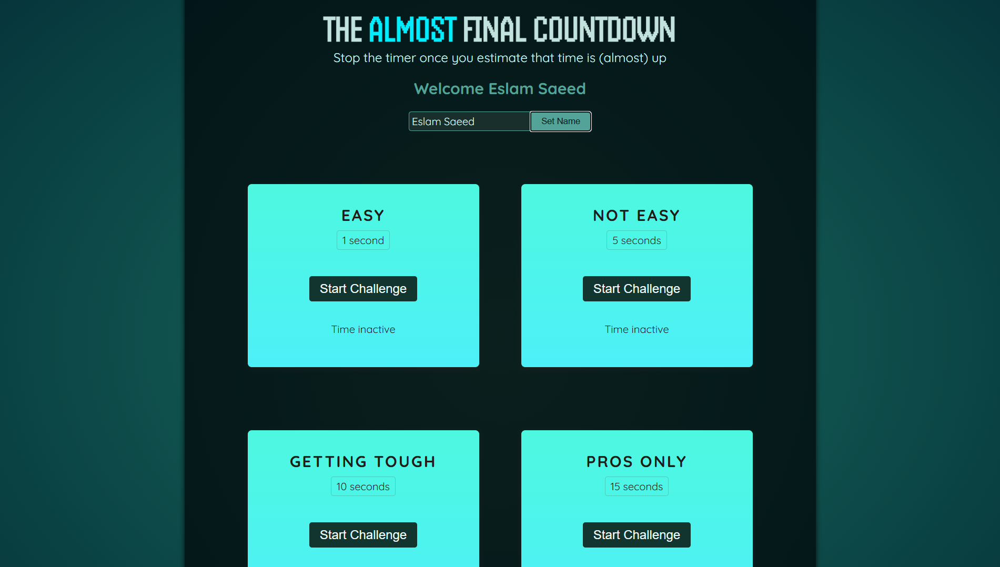

# ⏱️ Timer Challenge Game



A fun, interactive React-based timer challenge game where players test their timing skills across multiple difficulty levels. Built with modern React features including refs, useImperativeHandle, and custom components.

## 🎮 Game Overview

The Timer Challenge Game presents players with multiple timed challenges of varying difficulty levels. The goal is to stop the timer as close to the target time as possible without letting it run out completely.

### 🎯 Game Features

- **4 Difficulty Levels**: Easy (1s), Not Easy (5s), Getting Tough (10s), and Pros Only (15s)
- **Real-time Timer**: Precise timing with 10ms intervals
- **Scoring System**: Score based on how close you get to the target time
- **Modal Results**: Beautiful modal dialogs showing your performance
- **Player Name**: Personalized experience with custom player names
- **Responsive Design**: Sleek, modern UI with animations and hover effects

## 🚀 Getting Started

### Prerequisites

- Node.js (v14 or higher)
- npm or yarn package manager

### Installation

1. **Clone the repository**
   ```bash
   git clone https://github.com/Eslamsaeed880/timer-challenge.git
   cd timer-challenge
   ```

2. **Install dependencies**
   ```bash
   npm install
   ```

3. **Start the development server**
   ```bash
   npm run dev
   ```

4. **Open your browser**
   Navigate to `http://localhost:5173` (or the port shown in your terminal)

### Available Scripts

- `npm run dev` - Start development server
- `npm run build` - Build for production
- `npm run preview` - Preview production build
- `npm run lint` - Run ESLint for code quality

## 🎮 How to Play

1. **Set Your Name**: Enter your name in the input field and click "Set Name"
2. **Choose a Challenge**: Select from four difficulty levels
3. **Start the Timer**: Click "Start Challenge" to begin the countdown
4. **Stop at the Right Time**: Try to stop the timer as close to the target time as possible
5. **View Your Score**: See your results in the modal dialog
6. **Try Again**: Close the modal and attempt the challenge again

### 🏆 Scoring System

- **Perfect Stop**: The closer you stop to the target time, the higher your score
- **Time Out**: If the timer reaches zero, you lose the challenge
- **Score Calculation**: `Score = (1 - remainingTime / targetTime) * 100`

## 🛠️ Technical Features

### React Concepts Demonstrated

- **useRef Hook**: Direct DOM manipulation and timer management
- **useState Hook**: Component state management
- **useImperativeHandle**: Custom ref API for child components
- **forwardRef**: Ref forwarding to child components
- **Component Communication**: Parent-child component interaction

### Key Components

#### `App.jsx`
Main application component that renders the player section and all timer challenges.

#### `Player.jsx`
- Handles player name input and display
- Uses `useRef` for direct input access
- Manages player name state with `useState`

#### `TimerChallenge.jsx`
- Core game logic for individual challenges
- Timer management with `setInterval`
- State management for active/inactive states
- Integration with result modal

#### `ResultModal.jsx`
- Custom modal component using HTML `<dialog>` element
- Implements `useImperativeHandle` for programmatic control
- Displays game results and scoring
- Handles modal open/close functionality

## 🎨 Styling Features

- **Modern CSS**: Custom properties and modern layout techniques
- **Gradient Backgrounds**: Beautiful radial gradients
- **Animations**: Smooth slide-in animations and flash effects
- **Responsive Design**: Flexbox layout for various screen sizes
- **Custom Fonts**: Google Fonts integration (Quicksand & Handjet)

### Color Scheme
- Primary: Teal/cyan theme (`#186a5e`, `#4df8df`)
- Background: Dark gradient (`#053339` to `#021619`)
- Accents: Bright cyan (`#00eeff`) and various teal shades

## 📁 Project Structure

```
timer/
├── public/
│   └── vite.svg
├── src/
│   ├── components/
│   │   ├── Player.jsx
│   │   ├── TimerChallenge.jsx
│   │   └── ResultModal.jsx
│   ├── assets/
│   │   └── react.svg
│   ├── App.jsx
│   ├── main.jsx
│   └── index.css
├── index.html
├── package.json
├── vite.config.js
└── README.md
```

## 🔧 Technologies Used

- **React 19**: Latest React with modern hooks
- **Vite**: Fast build tool and development server
- **ESLint**: Code linting and quality assurance
- **CSS3**: Modern styling with animations
- **HTML5 Dialog**: Native modal functionality

## 🎯 Learning Objectives

This project demonstrates:

1. **Advanced React Patterns**: Ref forwarding, imperative handles
2. **Timer Management**: Working with intervals and precise timing
3. **Component Architecture**: Reusable, modular components
4. **State Management**: Multiple state patterns and data flow
5. **Modern CSS**: Animations, gradients, and responsive design
6. **User Experience**: Interactive feedback and smooth animations

## 🚀 Future Enhancements

- [ ] High score persistence with localStorage
- [ ] Sound effects and audio feedback
- [ ] Multiple game modes (countdown, precision, etc.)
- [ ] Leaderboard system
- [ ] Progressive difficulty scaling
- [ ] Mobile touch optimization
- [ ] Achievement system

## 🤝 Contributing

1. Fork the repository
2. Create your feature branch (`git checkout -b feature/AmazingFeature`)
3. Commit your changes (`git commit -m 'Add some AmazingFeature'`)
4. Push to the branch (`git push origin feature/AmazingFeature`)
5. Open a Pull Request

## 📝 License

This project is open source and available under the [MIT License](LICENSE).

## 🙏 Acknowledgments

- React team for the amazing framework
- Vite team for the blazing fast build tool
- Google Fonts for the beautiful typography
- The open-source community for inspiration and resources

---

**Happy Gaming! 🎮** Test your timing skills and see how precise you can be!
